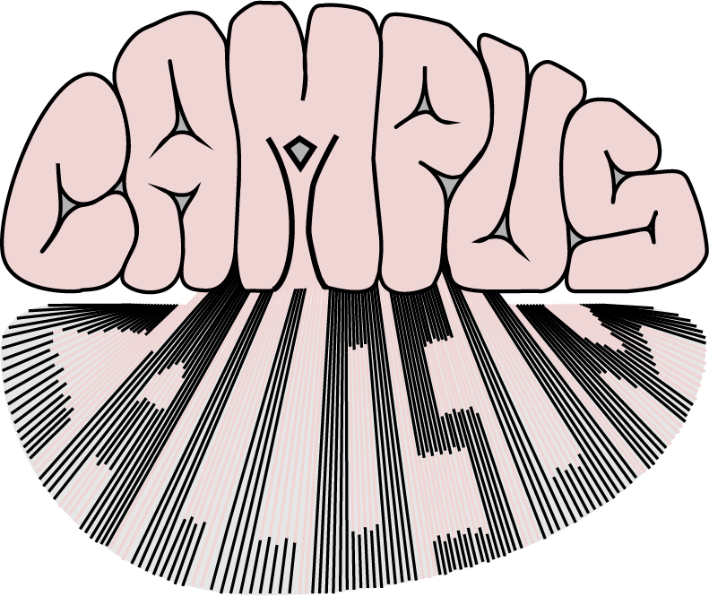
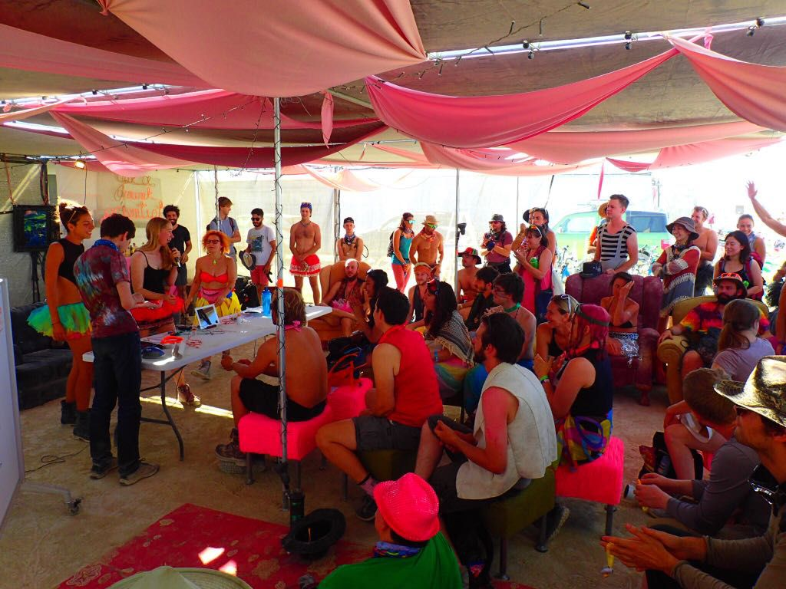
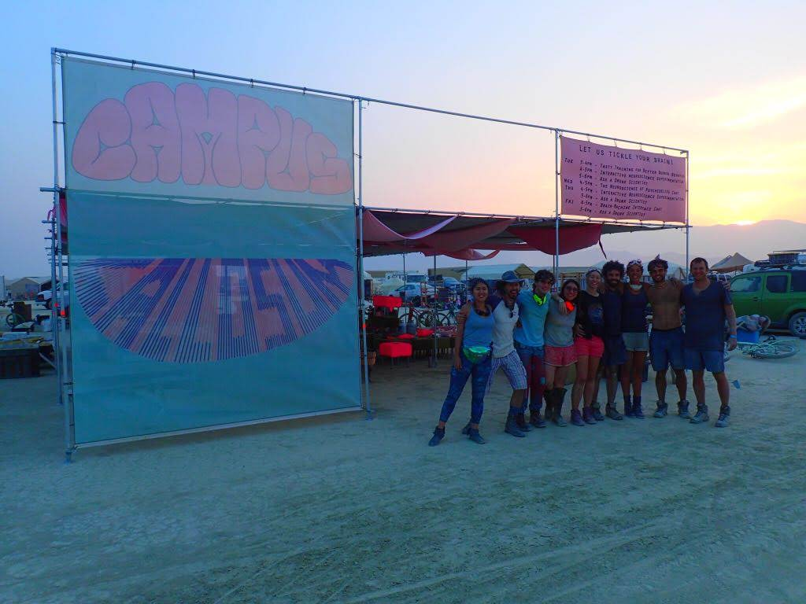
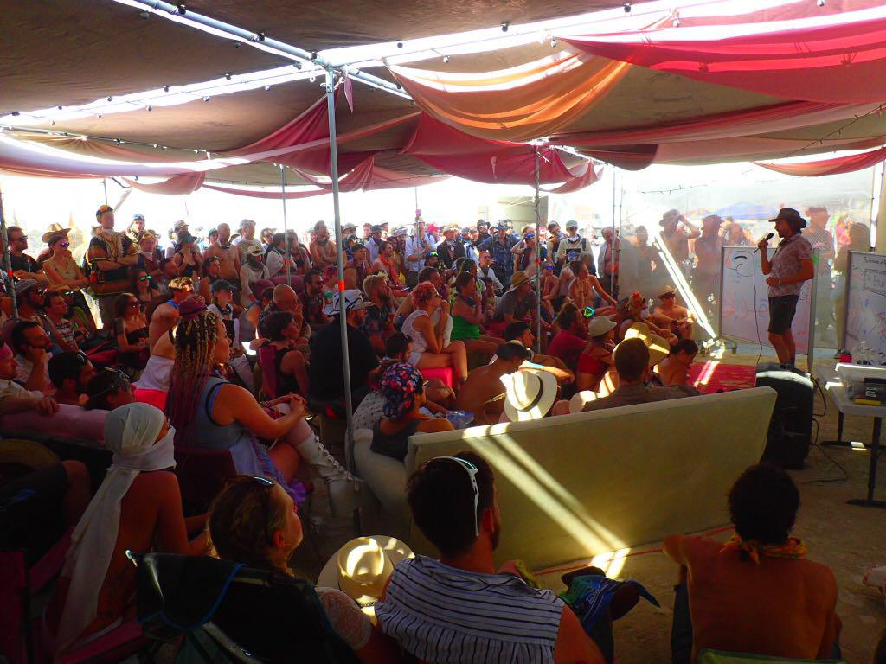
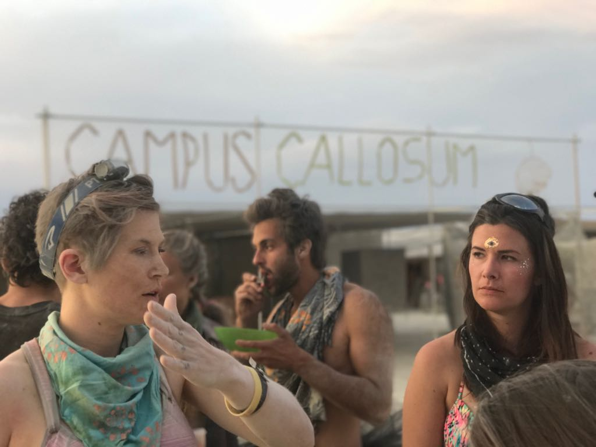

---
#
# By default, content added below the "---" mark will appear in the home page
# between the top bar and the list of recent posts.
# To change the home page layout, edit the _layouts/home.html file.
# https://jekyllrb.com/docs/themes/#overriding-theme-defaults
#
layout: page
---

<b>Find us at 2:30 & A</b>

Our favorite fiber tract, the Campus Callosum, is going back to Burning Man this year and looking to form new connections! Our camp has the goal of bringing more science to the playa. We're a bunch of scientists, geeks, and friends interested in sharing, learning, and discussing science with the BRC community. Our mission is to be a place for science enthusiasts to come and share their excitement, and where scientific perspectives can be added to a wide range of discussions and topics accessible to every burner.

## Schedule

| Date | Time | Event | Info |
|------|------|-------|------|
| 08/01 | 9:00am - 11:am | Welcome drinks | XXXXXXXXXXXXXXXXX |

## Photos

## Contact us
[campuscallosum@gmail.com](mailto:campuscallosum@gmail.com)

Find us on [Instagram](https://www.instagram.com/campus_callosum/)